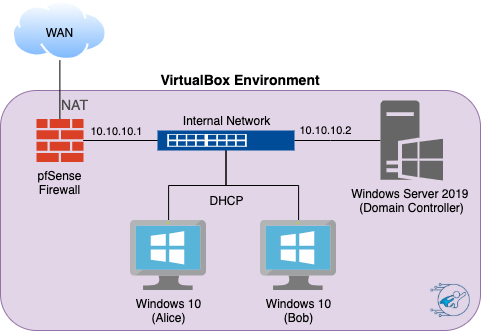
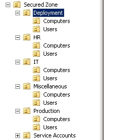
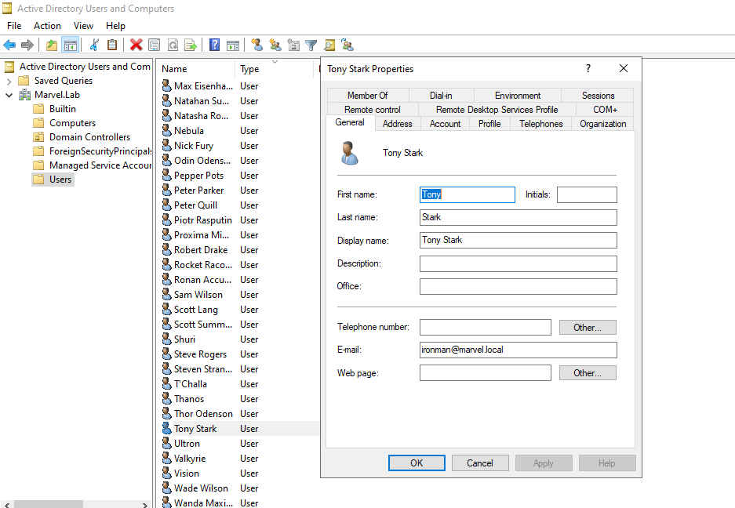
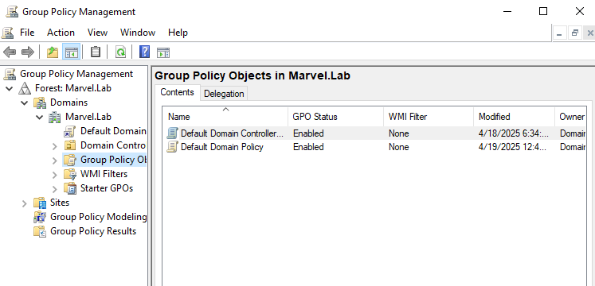

# 🧩 Marvel-Themed Domain Controller Lab

 <!-- Replace with a cover image -->

---

## 📘 Introduction

This lab focuses on building and configuring a Windows Server Domain Controller in a virtual lab environment. Inspired by a Marvel-themed enterprise setup, the project involves creating a full Active Directory forest with organizational units, users, and group policies to simulate real-world network architecture and centralized management.

---

## 🎯 Objectives

- Install and configure a Windows Server Domain Controller
- Set up a new forest and domain (e.g., marvel.local)
- Create OUs and Marvel-themed users (e.g., IronMan, Thor)
- Apply and test custom Group Policy Objects (GPOs)

---

## 🧰 Tools & Technologies

| Tool/Service       | Purpose                                     |
|--------------------|---------------------------------------------|
| Windows Server 2019| Domain Controller and AD DS                 |
| Active Directory   | Centralized identity and access management |
| Group Policy       | Policy enforcement across OUs               |
| PowerShell         | Scripting and user automation               |

---

## 🧪 Lab Setup

### ✅ Step 1: Install Active Directory Roles

1. Open **Server Manager** → Manage → Add Roles and Features  
2. Install the following roles:
   - Active Directory Domain Services
   - DNS Server

---

### ✅ Step 2: Promote Server to Domain Controller

1. After installation, click **Promote this server to a domain controller**  
2. Choose:
   - **Add a new forest**
   - **Root domain name**: `marvel.local`  
3. Set a DSRM password and continue with the defaults.  
4. Restart the server after promotion.

---

### ✅ Step 3: Create Marvel-Themed Organizational Units

Open **Active Directory Users and Computers**, then create the following OUs:

- `Avengers`
- `SHIELD`
- `Hydra`
- `IT`
- `Finance`

---

### ✅ Step 4: Create Users and Assign Them to OUs

Use GUI or PowerShell to create users:

```powershell
New-ADUser -Name "Tony Stark" -SamAccountName tony.stark -UserPrincipalName tony.stark@marvel.local -AccountPassword (ConvertTo-SecureString "Password123!" -AsPlainText -Force) -Enabled $true -Path "OU=Avengers,DC=marvel,DC=local"
```

Repeat for other users (e.g., Steve Rogers, Natasha Romanoff, Nick Fury, etc.)

---

### ✅ Step 5: Apply Group Policy Objects (GPOs)

1. Open **Group Policy Management Console (GPMC)**
2. Create and link GPOs to specific OUs:
   - Login banners for `SHIELD`
   - Password complexity policies
   - Desktop wallpapers for `Avengers`
3. Run `gpupdate /force` on a client to apply policies.

---

## 📸 Screenshots

| Description                      | Screenshot                         |
|----------------------------------|-------------------------------------|
| AD OU structure                  |     |
| Marvel-themed users in AD        |     |
| GPO applied to Avengers OU       |     |

---

## ✅ Key Takeaways

- Configured a complete AD forest from scratch  
- Created and organized a domain with themed OUs and users  
- Built and applied GPOs for security and UX management  
- Practiced Windows Server admin skills in a simulated enterprise

---

## 📎 References

- Microsoft Learn: [Active Directory Domain Services](https://learn.microsoft.com/en-us/windows-server/identity/ad-ds/ad-ds-overview)
- Marvel Lab GitHub: [Marvel Lab](https://github.com/jsecurity101/Marvel-Lab)

---

## 📬 About Me

👋 I'm **Zee**, a cybersecurity analyst focused on building secure environments, hardening infrastructure, and simulating enterprise-level defense strategies in lab environments.

🔗 [Connect with me on LinkedIn](https://www.linkedin.com/in/zee-williams)  
🔍 [View more labs on my GitHub](https://github.com/zeewilliams)
```
